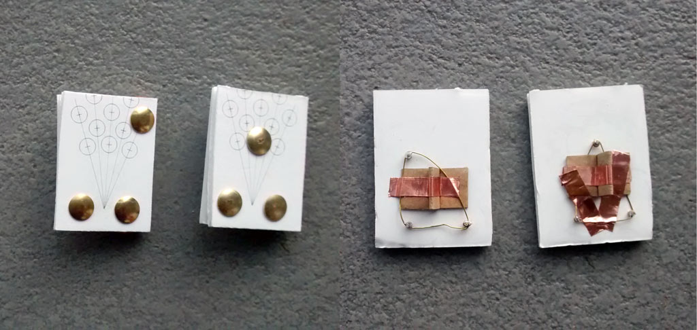
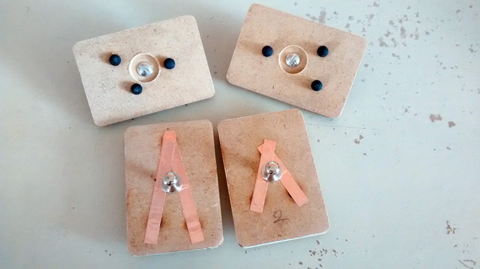

# wooden-smart-toy
####A js port from a previous as3 lib to detect and identify on iPad, iPhone and some Android Device<br/>patented wooden pieces created and sold by Marbotic.fr <br>DIY wooden smart Pieces with custom touch pattern (see below)

![marbotic wooden pieces] (http://www.marbotic.fr/wp-content/uploads/2013/11/chiffres-rond-400x400.jpg) ![marbotic wooden pieces - back view] (http://www.marbotic.fr/wp-content/uploads/2013/11/chiffres-picots-400x400.jpg)

I've just done reverse engineering to find a way to detect and read Touch patterns.

To avoid stress to Marbotic's Founder, i decide to NOT publish in this js lib, the patterns used by Marbotic's smartNumbers & SmartLetters, but with some work, it's easy to find (at my first attempt, i've used a copymachine, a ruler and a protractor)

###the secret part:
Each Touch Piece is connected to touchscreen by 3 touch pods with specific configuration.<br />
Two pods are for the "base" (always the same width).<br/>
The last pod is the satellite point which made the pattern, give the significant part.<br/>
The satellite point is define by angle and distance from the middle point of the base, in polar's coords.
The base width is fixe and always the smallest from the 3 pod's distance.

###the non secret rest:
To avoid screensize pb detection, i've decided to work in millimeter, but a web browser is enable to detect screen size (not resolution, but size 7, 9, 10 inches of the touchscreen)
The lib use a variable to convert pixel to mm (it depend of the tablet model)

The detection on **Android Device** is not as accurate as expected and in many case the detection is false. 
It is an hardware touchscreen accuratie problem... cheap hardware are not enough accurate for this task than more expensive hardware as High end tablets like Samsung or Apple.

With <code>navigator.userAgent</code> you're able to detect "iPad" or "iPhone" string.
At this point there is few hardware (only 3 size for iPad). You must ask to your user to select the right model and store answer in <code>localStorage</code> or use a specific value for your hardware.
By default (cause i work with), the lib use the iPad mini value.

I'm not developer, just graphic & interaction designer, i do apologize for my bad english and my hugly code.
Hope this will help!

As a port of an as3 lib, i've used a js port of Point() as3's lib from Moagrius
https://github.com/moagrius/Point
I provide a minified version of his lib for your convenience.

To use it you need at least 3 touch points on screen to instanciate a new Piece with 3 Points.
```js
<script src="lib/Point.min.js"></script>
<script src="lib/Piece.dev.js"></script>

....

<script>
	document.addEventListener('touchstart', function(event) {
		event.preventDefault();
		if (event.touches.length>=3) {
			var p0 = new Point(touches[0].pageX, touches[0].pageY);
			var p1 = new Point(touches[1].pageX, touches[1].pageY);
			var p2 = new Point(touches[2].pageX, touches[2].pageY);
			// for use with iPadMini (only 3 points)
			pi = new Piece(p0,p1,p2);
			// for use with iPad
			pi = new Piece(p0,p1,p2, 51.93);
			// have some feedback about detection
			console.log(pi.toString());
		}
	});
</script>
```

The Piece object is populated with some cool values about the detected piece.
- <code>idPiece</code>: *the Piece's id* (what you design)
- <code>anglePiece</code>: *orientation of the piece on the screen*
- <code>PieceInv</code>: (Boolean) *is the piece reverse on the screen? (some pieces have reversed pattern, this is __not__ what it return)*
- <code>PatternInv</code>: (Boolean) *is the pattern reverse on the piece? (some pieces have reversed pattern)*
- <code>anglePattern</code>: (Number) *the angle of the pattern on the wood piece (in degres)* (what you design)
- <code>rhoMM</code>: (Number) *satellite point's distance from the base (in millimeters)*
- <code>theta</code>: (Number) *satellite point's angle vs the base (in degres)*
- <code>ecartBaseMM</code>: (Number) *the width of the base (in millimeters)*
- <code>ecartBasePX</code>: (Number) *the width of the base (in pixels)*


### DIY Piece with laser cut

I provide in the "lasercut_draw" folder:
- [1 ai file](lasercut_draw/custom_piece_18mm_lasercut_ill8.ai) (Illustrator 8 format) for making custom Piece for Trotek laser cut
- [1 ai file](lasercut_draw/custom_piece_18mm_model_cs3.ai) (Illustrator CS3 format) with model for custom Piece
- [1 pdf file](lasercut_draw/custom_piece_18mm_lasercut.pdf) for reference purpose
- [1 pdf to print](lasercut_draw/reference_to_print.pdf) for cheap & quick experiments


####Cheapest and quickest (but lasercutless):
You need to:
- print at 100% the [pdf](lasercut_draw/reference_to_print.pdf), cut a pattern and glue on a piece of cardboard.
- Use 3 brass pinholders to design a pattern (2 pins for base pods and satellite one).
- connect the 3 pinholders with a conductive wire (brass)<br>
Handle this DIY Piece by the wire to maintain a conduction from the pattern on the back to your fingers.


####Less cheap, less quick (but more lasercut):
You need:
- conductive rubber tips. I've bought mine on alibaba from [unicon rubber](http://www.alibaba.com/product-detail/silicone-conductive-rubber-soft-stylus-tip_517071997.html)<br>
!(lasercut_draw/uniconrubber_tips.jpg)
My tips are 10mm long for a diameter of 6mm.<br>
- MDF panel in 6mm thick (2 cut of 3mm MDF for me).<br>
- Copper tape from 3M in 5mm (EMI shielding tape). I've found mine at Conrad, but [here from sparkfun](https://www.sparkfun.com/products/10561)
- "Collar Button Screw"/"bouton de col à visser"  (sorry for Goog translation)<br>
<br>

Put and glue the conductive tips on the edge of one face of the laser cutted piece.
Connect the three touch pods with bands of the 3M's copper tape.<br>
Screw the "Collar Button Screw" (drill a 3mm hole in the middle of the piece) in contact with the copper tape as in the picture below<br>


<br>

Patents for touch grid and conduction way between capacitive screen and body are in order patented by
- Etienne Jean MINEUR and Bertrand DUPLAT, [édition Volumique](http://www.volumique.com) [FR 2995423, FR 2994752, FR 2970352]*
- Marie MÉROUZE, [Marbotic](http://www.marbotic.fr) [FR 3003661]*

*[N° Patents find on http://www.inpi.fr]
